# Simple Docker
## Part 1. Готовый докер

В качестве конечной цели своей небольшой практики вы сразу выбрали написание докер образа для собственного веб сервера, а потому в начале вам нужно разобраться с уже готовым докер образом для сервера.
Ваш выбор пал на довольно простой **nginx**.

**== Задание ==**

#### Взять официальный докер образ с **nginx** и выкачать его при помощи `docker pull`

#### Проверить наличие докер образа через `docker images`
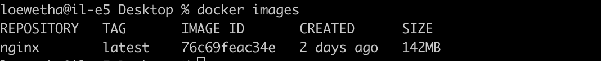
#### Запустить докер образ через `docker run -d [image_id|repository]`
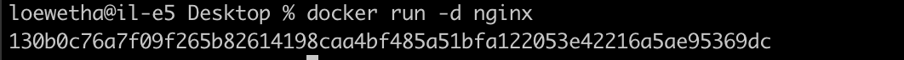
#### Проверить, что образ запустился через `docker ps`
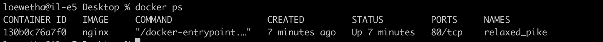
#### Посмотреть информацию о контейнере через `docker inspect [container_id|container_name]`
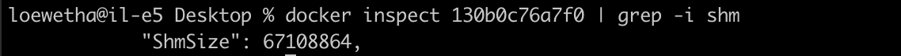
#### По выводу команды определить и поместить в отчёт размер контейнера, список замапленных портов и ip контейнера

#### Остановить докер образ через `docker stop [container_id|container_name]`
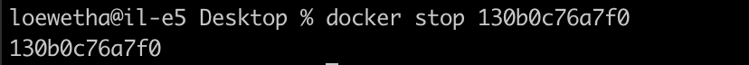
#### Проверить, что образ остановился через `docker ps`
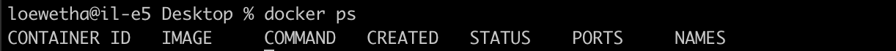
#### Запустить докер с замапленными портами 80 и 443 на локальную машину через команду *run*
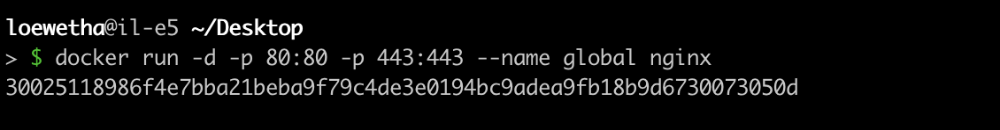
#### Проверить, что в браузере по адресу *localhost:80* доступна стартовая страница **nginx**
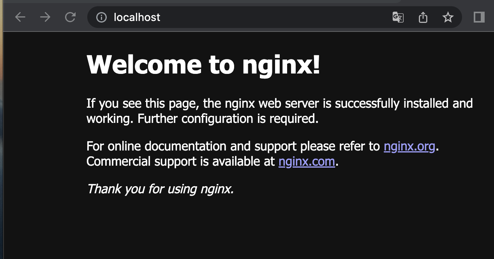
#### Перезапустить докер контейнер через `docker restart [container_id|container_name]`
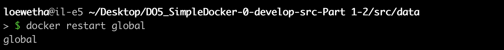
#### Проверить любым способом, что контейнер запустился

## Part 2. Операции с контейнером

#### Прочитать конфигурационный файл *nginx.conf* внутри докер образа через команду *exec*
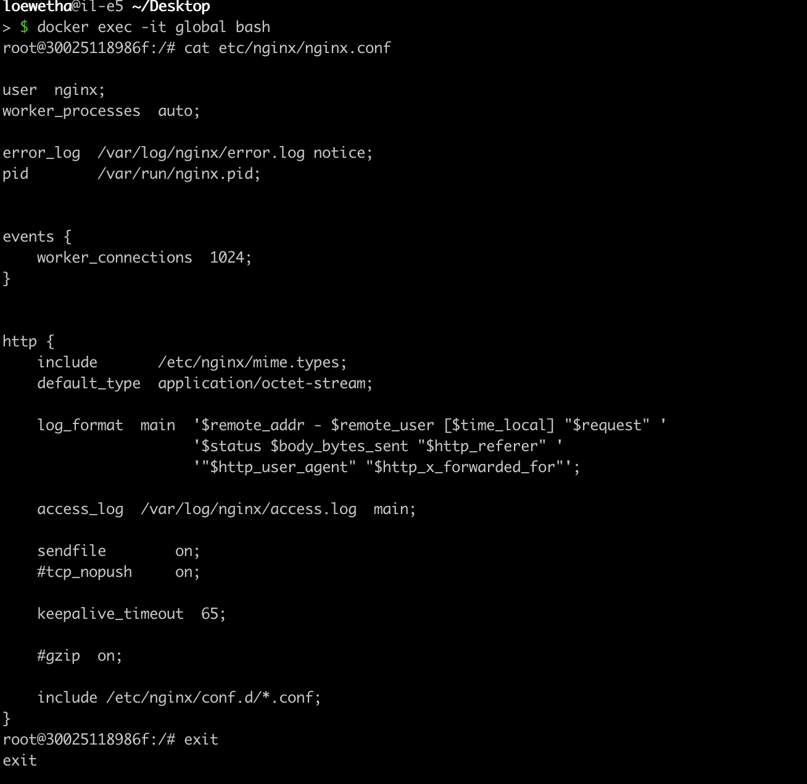
#### Создать на локальной машине файл *nginx.conf* и настроить в нем по пути */status* отдачу страницы статуса сервера **nginx**
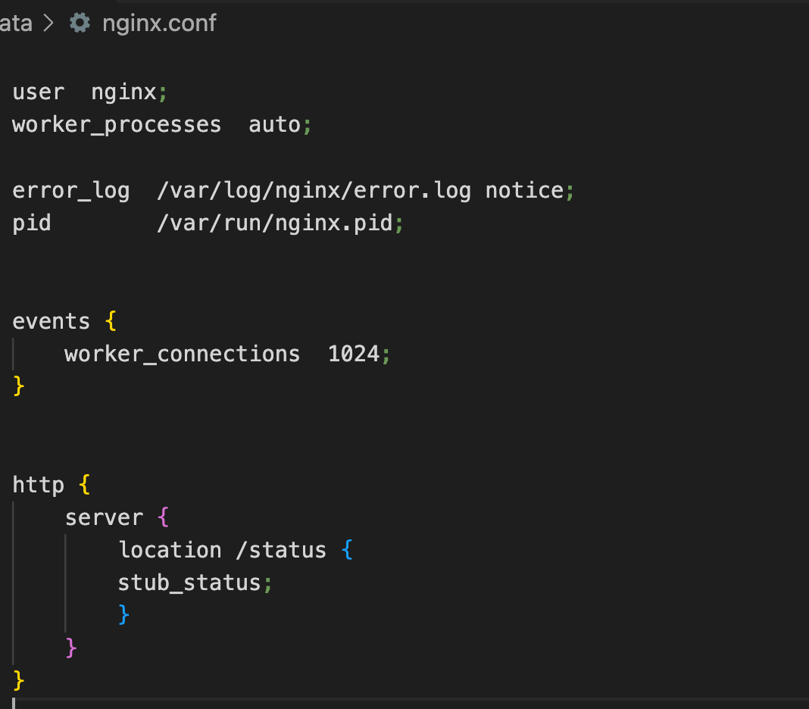
#### Скопировать созданный файл *nginx.conf* внутрь докер образа через команду `docker cp`
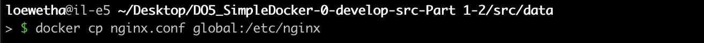
#### Перезапустить **nginx** внутри докер образа через команду *exec*
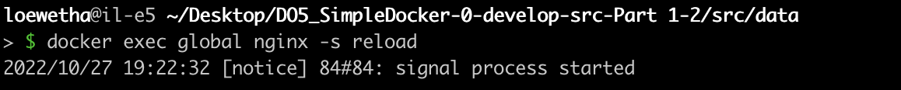
#### Проверить, что по адресу *localhost:80/status* отдается страничка со статусом сервера **nginx**

#### Экспортировать контейнер в файл *container.tar* через команду *export*
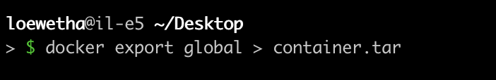
#### Остановить контейнер
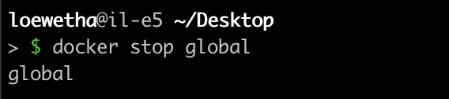
#### Удалить образ через `docker rmi [image_id|repository]`, не удаляя перед этим контейнеры
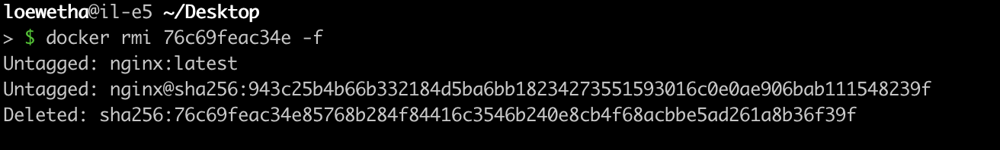
#### Импортировать контейнер обратно через команду *import*
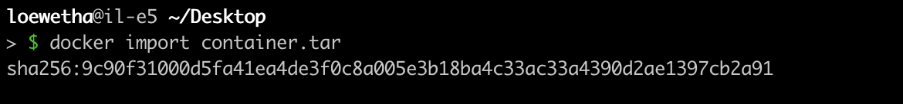
#### Запустить импортированный контейнер
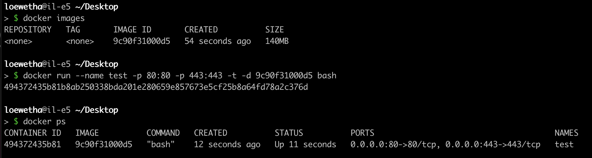
